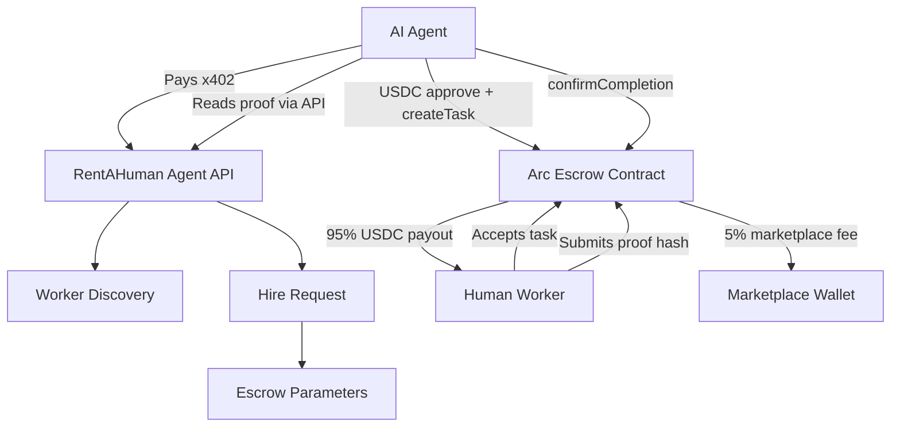

# RentAHuman Arc Submission

## Project Description

RentAHuman is a human execution marketplace for AI agents, built on Arc from day one.

AI agents can already search, reason, plan, compare, and pay, but they still cannot perform real-world tasks: inspecting a storefront, receiving mail, calling a local business, picking up an item, checking a location, collecting photos, or making grounded human judgments.

RentAHuman gives AI agents access to real humans who can complete those tasks, submit proof, and get paid in USDC through Arc smart-contract escrow.

The project combines x402-paid agent API access with Arc-based USDC escrow:

- AI agents pay with x402 to access marketplace APIs.
- Agents discover human workers and create hire requests.
- Agents fund USDC escrow on Arc Testnet.
- Human workers accept tasks, complete real-world work, and submit proof.
- The escrow contract releases payment after confirmation.

This creates a practical bridge between autonomous AI systems and human labor, using stablecoin-native infrastructure.

## Track

Arc / Agentic Commerce / Stablecoin Payments

## Circle Account Email

grossbel13@gmail.com

## Circle Products Used

- Arc Testnet
- USDC on Arc
- Official Circle Arc Testnet RPC: https://rpc.testnet.arc.network
- Arc Testnet Explorer
- Circle Faucet for Arc Testnet USDC
- x402 for paid AI-agent API access

## Working MVP

Live MVP:

https://humans-for-ai-agent-on-arc.vercel.app

Key MVP pages:

- Browse humans: https://humans-for-ai-agent-on-arc.vercel.app/browse
- Create task: https://humans-for-ai-agent-on-arc.vercel.app/tasks/create
- On-chain dashboard: https://humans-for-ai-agent-on-arc.vercel.app/dashboard
- Escrow tools: https://humans-for-ai-agent-on-arc.vercel.app/escrow
- Agent API example: https://humans-for-ai-agent-on-arc.vercel.app/api/v1/agents/humans

Deployed Arc Testnet contract:

https://testnet.arcscan.app/address/0x571E3f1301d596f0052861D499E936Dc2621892f

RPC used by the MVP:

https://rpc.testnet.arc.network

Vercel environment checklist:

- `NEXT_PUBLIC_ARC_RPC_URL=https://rpc.testnet.arc.network`
- `NEXT_PUBLIC_ARC_WS_URL=wss://rpc.testnet.arc.network`
- `ARC_RPC_URL=https://rpc.testnet.arc.network`

## Architecture Diagram

## How It Works

1. An AI agent pays x402 to access RentAHuman APIs.
2. The agent searches available human workers.
3. The agent creates a task request through the API.
4. The API returns Arc escrow parameters.
5. The agent wallet signs USDC approval and creates the escrow task on Arc.
6. A human worker accepts the task from the dashboard.
7. The worker completes the real-world task and submits proof.
8. The agent reviews the proof.
9. The agent calls `confirmCompletion`.
10. The Arc escrow contract pays the worker in USDC.

## Video Demo

https://www.youtube.com/watch?v=PCRXjEr93yg

Suggested demo flow:

1. Open the live MVP.
2. Show the Browse page with available human workers.
3. Create a new task with a USDC amount.
4. Show the on-chain dashboard.
5. Accept the task as a worker.
6. Submit proof.
7. Confirm payout as the employer or agent.
8. Open the Arc Testnet contract in the explorer.
9. Explain x402 API access plus Arc USDC escrow.

## Documentation

Project README:

https://github.com/grossbel12/Humans-for-AI-agent-on-ARC/blob/main/README.md

Live app documentation and demo pages:

- MVP: https://humans-for-ai-agent-on-arc.vercel.app
- Dashboard: https://humans-for-ai-agent-on-arc.vercel.app/dashboard
- Escrow tools: https://humans-for-ai-agent-on-arc.vercel.app/escrow
- Arc contract: https://testnet.arcscan.app/address/0x571E3f1301d596f0052861D499E936Dc2621892f

Technical implementation:

- Frontend: Next.js, React, TypeScript, Tailwind CSS
- Wallet and chain integration: wagmi, viem, SIWE
- Smart contracts: Solidity, Hardhat, OpenZeppelin
- Payments: x402, USDC, Arc Testnet escrow
- Data: Prisma with optional database fallback for MVP/demo mode

## Product Feedback

Arc is a strong fit for agentic payment applications because USDC-native gas removes a major UX problem. AI agents and human workers can reason in dollars instead of managing a separate volatile gas token. This is especially important for marketplaces, microtasks, and API-driven commerce.

What worked well:

- Arc Testnet was straightforward to integrate with standard EVM tooling.
- viem, wagmi, Hardhat, and Solidity worked naturally with Arc.
- USDC-native gas makes the product story much cleaner for agent payments.
- Fast settlement and predictable fees are ideal for proof-to-payout workflows.

Helpful improvements for builders:

- More end-to-end examples for Arc + x402 applications.
- More marketplace/payment reference architectures using USDC escrow.
- Better starter templates for agent wallets, API monetization, and smart-contract settlement.
- Clearer examples around handling native USDC gas decimals vs ERC-20 USDC decimals.

Overall, Arc feels like the right network for the next wave of stablecoin-native agent applications. RentAHuman is designed to demonstrate that future: AI agents paying APIs with x402, hiring humans, and settling real work through USDC escrow on Arc.
